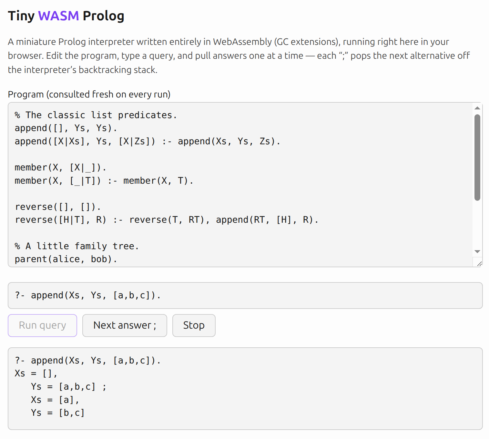

# EXPERIMENT (Claude Fable 5): A tiny Prolog interpreter in WebAssembly

> **Human note:** [Try it here!](https://docs.randomhacks.net/fable-wasm-prolog/)
>
> This is an experiment with an autonomous Claude Fable run, to see what it can one-shot, and how good the code quality is. Here are the [original design notes that I wrote](./DESIGN_NOTES.md) and [Fable's plan](./PLAN.md), which includes my design feedback. The total cost was apparently **$16.75**, and the core Prolog implementation is 1,026 lines of WASM WAT.
>
> For comparison purposes, see my [ongoing handwritten toy WASM Lisp project](https://github.com/emk/toy-wasm-lisp). That is an _enormously_ self-indulgent hobby project designed to maximize learning and interesting yak-shaving opportunities, so it's hard to make a meaningful direct comparison.
>
> I imposed a number of funky restrictions on this design--no callbacks for I/O, raw WASM WAT with s-expression syntax, use of WASM GC. Now, there are absolutely _plenty_ of MiniKanren implementations out there in the training data, and plenty of WASM WAT examples. But WASM WAT GC assembly is a bit sparse at the time of writing, WASM GC documentation is still pretty cryptic, and my constraints forced some non-standard approaches in a few places. So you could argue that this project is _mostly_ interpolation and translation in some high-dimensional "design space", which LLMs are good at. But then again, an enormous portion of real-world software is basically fancy CRUD apps and similar variations on a theme. And this was the work of perhaps 30 minutes of thinking and prompting on my part.
>
> ```
> Total cost:            $16.75
> Total duration (API):  27m 41s
> Total duration (wall): 1h 1m 33s
> Total code changes:    2016 lines added, 77 lines removed
> Usage by model:
>      claude-haiku-4-5:  1.1k input, 29 output, 0 cache read, 0 cache write ($0.0013)
>      claude-fable-5:  13.5k input, 121.1k output, 6.1m cache read, 223.1k cache write ($16.75)
> ```
>
> I am reminded of Jernau Morat Gurgeh in _The Player of Games_, who is described as one of the best human (sort of) game players in a vast interstellar civilization. Gurgeh is extraordinarily skilled, probably 1 in a trillion. And yet it's taken as a given that he could be trivially defeated by any Mind. Gurgeh plays games because he loves them. And the Minds play games in which Gurgeh and the Empire of Azad are but pieces on the board.
> 
> The thing I *didn't* get out of this? Not even 1% of the knowledge I learned by working on [my toy WASM Lisp project](https://github.com/emk/toy-wasm-lisp).
>
> Anyway, this is a genuinely neat little bit of code, even if I didn't write a single line of it beyond the planning stage. Enjoy!

## Screenshot



## Introduction

A miniature Prolog — roughly the power of miniKanren / *The Reasoned
Schemer*, with normal Prolog syntax and no cut — written entirely in
hand-authored WebAssembly text format using the GC extensions. The
tokenizer, parser, printer, unification, and backtracking solver all
live in one heavily commented file, [`prolog.wat`](prolog.wat).

This is a learning artifact in the spirit of miniKanren or the small
interpreters in *Lisp in Small Pieces*: the goal is to show the core
ideas of a Prolog implementation as clearly as possible, not to be a
standards-compliant or production Prolog.

## Trying it

Requirements: Rust, [`wasm-tools`](https://github.com/bytecodealliance/wasm-tools),
and [`just`](https://github.com/casey/just) (`cargo install wasm-tools just`).

```console
$ just repl examples/family.pl
% consulted examples/family.pl
> ?- ancestor(alice, X).
X = bob ;
X = carol ;
X = dave ;
X = eve ;
false.
> likes(bob, prolog).
> ?- likes(bob, X).
X = prolog .
> halt.
```

At the `> ` prompt, input starting with `?-` runs as a query — type
`;` for the next answer, Enter to stop — and anything else is added
to the database as clauses. `just test` runs the test suite; `just
serve` builds `prolog.wasm` and serves a browser REPL (the same
interpreter, driven by ~60 lines of JavaScript) at
<http://localhost:8000>.

The language: atoms, variables, compound terms, lists (`[a,b|T]`),
`=`, `true`, conjunction via `,`, and user-defined predicates with
`Head :- Body` clauses. No cut, no arithmetic, no negation. Left
recursion loops forever, exactly as real Prolog's depth-first search
does (Ctrl-C works, and browsers stay responsive — see "fuel" below).

## How it works

Everything below is in `prolog.wat`, which is written to be read
top-to-bottom. The Rust wrapper (`src/`) and the web page
(`web/index.html`) only shuttle strings in and out.

**Terms** are WASM GC structs, allocated on the engine-managed heap —
there is no malloc and no memory management anywhere in the
interpreter. A term is either a variable `$var{id}` or an application
`$app{sym, args}`; an atom is just an application with zero
arguments, as in real Prolog. Functor names are interned into a
symbol table, so name equality is an integer compare. Lists are
ordinary `'.'(Head, Tail)` terms ending in the atom `[]`; only the
parser and printer know about the `[a,b|T]` sugar.

**Substitutions** are immutable association lists mapping variable
ids to terms, exactly as in miniKanren. `$walk` resolves a variable
through a substitution; `$unify` walks both terms and either binds an
unbound variable or matches functor/arity and recurses on arguments.
Because substitutions are never mutated, backtracking never has to
undo a binding — old substitutions are simply still there. (We also
do the occurs check, which real Prologs skip for speed: `?- X = f(X).`
fails instead of building a cyclic term.)

**The solver** is the interesting part. A recursive Prolog solver
needs some way to suspend the search between answers; instead, this
one keeps the entire search frontier as *plain data*: a stack of
frames, each "prove this list of goals under this substitution".
That is a miniKanren stream with the closures replaced by data — and
it means the host can pull one answer at a time with a plain function
call, no callbacks, coroutines, or async anywhere:

- `query_begin` parses a query and pushes one frame.
- `query_next` pops a frame and looks at its first goal. `true`
  succeeds; `=` unifies; a user predicate pushes one new frame per
  matching database clause (first clause on top, giving Prolog's
  clause order), with the clause's variables renamed apart and its
  body goals prepended. A goal that fails pushes nothing — so the
  next pop resumes the most recent alternative, and *popping the
  stack is backtracking*. A frame with no goals left is a solution:
  print the query variables' bindings and return.

`query_next` takes a **fuel** budget: the maximum number of frames it
pops before returning "still searching, call me again". That is what
lets the browser page run `?- loop.` (where `loop :- loop.`) without
freezing the tab — the page just yields to the event loop between
calls.

**The boundary**: terms never cross it. The module exports one page
of linear memory used purely as a mailbox — the host writes query
text at offset 0, and the interpreter leaves answer text at offset
32768 — so driving the interpreter from JavaScript takes a
`TextEncoder`, a `TextDecoder`, and three function calls.

## Layout

```
prolog.wat       the whole interpreter
src/             thin wasmtime wrapper: REPL (main.rs) + API (lib.rs)
tests/prolog.rs  the test suite (round-trips, unification, backtracking)
examples/        family tree, classic list predicates
web/index.html   single-file browser REPL
PLAN.md          the implementation plan this was built from
```
